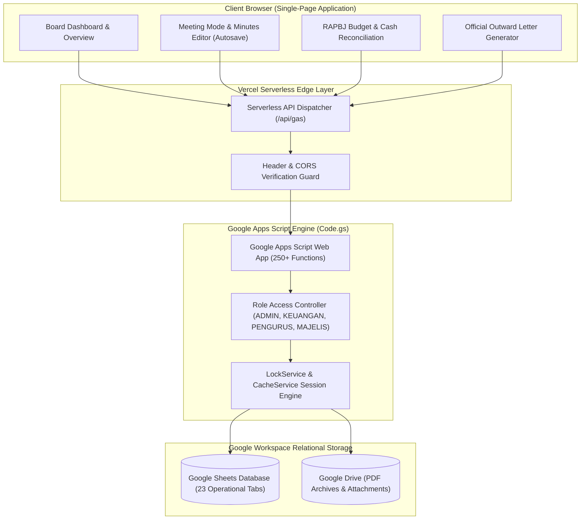

# Majelis Galilea — Church Governance & Board Administration System

> A centralized administration platform and workflow automation system built with Google Apps Script, Vercel Serverless proxying, and a 23-tab Google Sheets relational database.

[](#)
[](https://github.com/zvenians/majelis-galilea/actions/workflows/ci.yml)
[](https://majelis-galilea.vercel.app)
[-4285F4?style=flat-square&logo=google)](https://developers.google.com/apps-script)
[](https://vercel.com/)
[-34A853?style=flat-square&logo=googlesheets&logoColor=white)](https://www.google.com/sheets/about/)
[](#)

---

## 1. Project Overview

**Majelis Galilea** is the official church governance, administrative workflow, and records management portal for the church board (*Majelis Jemaat*) of GMAHK Galilea Balikpapan.

It unifies meeting minutes management, resolutions, departmental program tracking, annual budget planning (*RAPBJ*), treasury reconciliation, congregational membership records, and official outward letter generation into a secure, single-page application.

---

## 2. Problem & Solution

### The Problem
Church board administration involves multiple interdependent stakeholders—Executive Elders, Church Secretaries, Treasurers, Department Leaders, and Ordained Board Members:
* **Fragmented Meeting Records:** Meeting minutes (*notulen*), agenda proposals, and formal resolutions were historically documented across ad-hoc text documents and messaging channels. Follow-ups were frequently missed and historical decisions were hard to trace.
* **Budget & Treasury Disconnect:** Annual congregational budget execution (*RAPBJ*) and departmental fund disbursements required constant manual coordination between treasurers and ministry heads, lacking real-time budget utilization visibility.
* **Secretarial Bottlenecks:** Preparing formal outgoing letters (*Surat Keluar*) with official church letterheads and sequential tracking numbers was a manual, desktop-bound process prone to duplicate numbering.

### The Solution
* **Unified Role-Aware Portal:** Provides a single-page web interface tailored to board workflows with real-time draft autosave and a live "Meeting Mode" for minute-taking during board sessions.
* **Granular Role-Based Access Control (RBAC):** Server-side clearance levels (ADMIN, KEUANGAN, PENGURUS, MAJELIS) ensure members only access and modify data aligned with their official capacity.
* **Structured 23-Tab Relational Database:** Utilizes Google Sheets as an accessible, zero-maintenance relational database backed by 250+ Google Apps Script business logic functions with `LockService` concurrency controls.
* **Edge Proxy Architecture:** Routes all requests through an isolated Vercel serverless proxy (`/api/gas`), completely concealing internal Google Apps Script deployment endpoints and securing communications.
* **Automated Document Automation:** In-browser PDF generation for official letters, meeting minutes, and financial statements directly archived to Google Drive.

---

## 3. System Architecture



---

## 4. Role-Based Access Control (RBAC)

The system enforces four distinct authorization tiers:

| Tier | Role | Description & Permissions |
|:---:|:---|:---|
| **`ADMIN`** | System Administrator | Full administrative authority; manages user accounts, role allocations, system parameters, and database schemas. |
| **`KEUANGAN`** | Treasury & Finance | Full management of church treasury accounts (*Kas Jemaat*, *Sumbangan*, *Uang Pembangunan*), annual budget plans (*RAPBJ*), and financial reconciliation. |
| **`PENGURUS`** | Executive Committee | Administrative oversight of board meetings, agenda scheduling, minutes approval, congregational membership records, and official correspondence. |
| **`MAJELIS`** | Board Member | Read access to approved minutes and reports; authority to submit agenda proposals, submit committee feedback, and monitor assigned action items. |

### Authentication Mechanism
- User authentication via **Username + PIN**.
- PINs are cryptographically hashed using **SHA-256 with dynamic salt**.
- Authenticated sessions are securely cached for 6 hours via Google Apps Script `CacheService`.

---

## 5. Core Administrative Modules

- **Meeting Governance Suite:**
  - Full CRUD lifecycle for Meeting Minutes (*Notulen Rapat*) with draft, review, and approval states.
  - Agenda proposal pipeline (*Usulan Agenda*) and formal resolution index (*Keputusan Rapat*).
  - Dedicated **Meeting Mode** enabling real-time minute drafting with autosave protection.
  - Action item tracker (*Tindak Lanjut*) with assigned deadlines and responsible parties.
- **Financial Oversight & Budgeting:**
  - Annual Congregational Budget Plan (*RAPBJ*) with real-time absorption tracking.
  - Multi-fund general ledger (*Kas Jemaat*, *Sumbangan*, *Uang Pembangunan*).
  - Monthly and annual reconciliation reporting with exportable summaries.
- **Congregational Records & Directory:**
  - Parishioner directory with family grouping and identity card generation.
  - Complete board executive roster (*Pengurus*) and committee assignments.
  - Church inventory and asset catalog (*Inventaris*).
- **Secretariat Automation:**
  - Outgoing official letter generator (*Surat Keluar*) with automated sequential numbering and church letterhead formatting.
  - Integrated PDF report compilation and direct Google Drive file attachments.

---

## 6. Technology Stack

- **Frontend:** Semantic HTML5, Modular CSS3, Vanilla JavaScript (ES6+), Single-Page Architecture
- **API Gateway:** Node.js, Vercel Serverless Functions (`/api/gas`)
- **Backend Service:** Google Apps Script (V8 Runtime, 250+ modular functions)
- **Database Engine:** Google Sheets (23 structured database sheets)
- **Cloud Tooling:** Google Clasp (`@google/clasp`), custom syntax validator (`scripts/validate-gas.js`)

---

## 7. Project Structure

```text
majelis-galilea/
├── admin/                     # Admin portal UI single-page application
│   └── index.html             # Full administration dashboard
├── api/                       # Vercel serverless functions
│   └── gas.js                 # Upstream Apps Script reverse proxy
├── apps-script/               # Upstream Google Apps Script sources
│   ├── appsscript.json        # Apps Script project manifest (V8 runtime)
│   └── Code.gs                # 250+ backend functions & business logic
├── scripts/                   # Local development & CI validation scripts
│   └── validate-gas.js        # Apps Script manifest and syntax validator
├── viewer/                    # Public viewer UI
│   └── index.html             # Read-only public meeting viewer
├── .clasp.json.example        # Clasp configuration template
├── vercel.json                # Vercel routing rules & security headers
└── README.md                  # Project documentation
```

---

## 8. Local Development & Clasp Setup

### 1. Prerequisites
- Node.js 20+
- Google Apps Script project with `Code.gs` and Google Sheets configured
- Vercel CLI (optional, for local proxy testing)

### 2. Clasp Configuration
Local development synchronizes with Google Apps Script using Google's `@google/clasp` CLI:

1. Copy the configuration template:
   ```bash
   cp .clasp.json.example .clasp.json
   ```
2. Populate `scriptId` with your Apps Script Project ID (**Apps Script Editor > Project Settings > Script ID**).
3. The `.clasp.json` file is ignored by Git (`.gitignore`) to safeguard project IDs.
4. Run syntax and manifest integrity validation:
   ```bash
   node scripts/validate-gas.js
   ```
5. Push changes to Google Apps Script:
   ```bash
   npx @google/clasp push
   ```

### 3. Local Proxy Preview
To preview the Vercel serverless proxy locally:

```bash
npx vercel dev
```

---

## 9. Environment Variables

Configure this environment variable in your Vercel Project Settings:

| Variable | Description | Exposure |
| :--- | :--- | :--- |
| `APPS_SCRIPT_URL` | Production Google Apps Script Web App Deployment URL | Server-only |

---

## 10. Deployment

1. Push commits to the `main` branch of this repository.
2. Link the repository in **Vercel**.
3. Configure the `APPS_SCRIPT_URL` environment variable.
4. Deploy:
   ```bash
   npx vercel --prod
   ```

---

## 11. Development & CI Workflow

The repository enforces backend syntax and manifest validation via GitHub Actions before code reaches production:

```text
Local Branch ──► Pull Request ──► GitHub Actions CI (validate-gas.js) ──► Merge to main ──► Vercel & Clasp Deploy
```

- **Local Verification:** Run `node scripts/validate-gas.js` locally to verify `appsscript.json`, syntax check all 24k+ lines of `Code.gs`, and ensure configuration integrity.
- **Automated Gating:** Every push and pull request to `main` triggers automated execution of the validation suite.
- **Zero Credential Exposure:** CI executes pure syntax and static integrity checks without requiring production Google Apps Script credentials.


